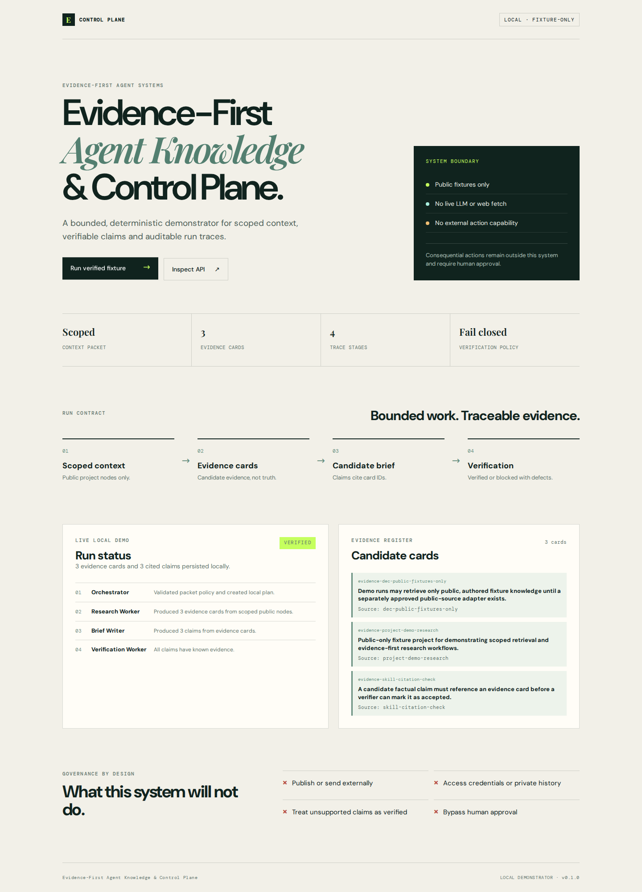

# Evidence-First Agent Knowledge & Control Plane

A public, local demonstrator for **scoped agent memory, bounded worker collaboration, evidence verification and human approval gates**.



> **Public fixtures only.** This repository must not contain personal conversation history, employer/client material, credentials or production agent logs.

## MVP principle

```text
scoped knowledge → bounded worker output → independent verification → audit trace
```

This is not an autonomous publishing system, an Obsidian clone, or a replacement for an agent runtime. It is a small, testable control-plane demonstrator.

## Current vertical slices

### P2.2 — Deterministic bounded worker pipeline

The local fixture workflow is intentionally provider-free and has no network or side-effect capability:

```text
orchestrator
  → research worker creates candidate evidence cards
  → brief writer creates candidate claims only from cards
  → verification worker accepts (`VERIFIED`) or rejects (`BLOCKED`)
```

Every run records a chronological trace. A claim without an evidence-card reference cannot reach `VERIFIED`.

### P2.3 — FastAPI + SQLite local run store

The app factory (`agent_control_plane.api:create_app`) exposes a small local API backed by SQLite:

| Method | Endpoint | Behavior |
|---|---|---|
| `POST` | `/tasks` | Creates a local `DRAFT` task. |
| `GET` | `/tasks/{task_id}` | Reads the persisted task state. |
| `POST` | `/tasks/{task_id}/run` | Runs only the deterministic public-fixture workflow. |
| `GET` | `/runs/{run_id}/trace` | Reads the persisted audit trace. |
| `GET` | `/runs/{run_id}/context-packet` | Reads the worker's scoped context packet. |

A task whose project has no public knowledge is rejected with `422` **before** a run is created. No endpoint can publish, send, spend, delete, or read credentials.

| Boundary | Enforced behavior |
|---|---|
| Knowledge scope | Only public nodes from the packet's project are selectable. |
| Worker actions | `retrieve`, `summarize`, and `cite` are required; missing actions fail closed. |
| Evidence | Each claim must reference an existing evidence card. |
| Verification | The verifier does not rewrite claims; it emits `VERIFIED` or exact defects. |
| External effects | Not implemented. Nothing can publish, send, spend, delete, or access credentials. |

## Local development

```bash
uv venv --python 3.11 .venv
uv pip install --python .venv/bin/python -e '.[dev]'
.venv/bin/python -m pytest
.venv/bin/python -m ruff check .
.venv/bin/python -m coverage run -m pytest
.venv/bin/python -m coverage report
```

## Run local API

```bash
.venv/bin/uvicorn --factory agent_control_plane.api:create_app --host 127.0.0.1 --port 8017
```

The portfolio dashboard is then available locally at `http://127.0.0.1:8017/`; it triggers the real fixture-only API run and renders its persisted evidence cards and trace. Interactive API docs are available at `http://127.0.0.1:8017/docs`. The default local database is `data/control-plane.sqlite3`, which is ignored by Git.

### Verify from a second laptop on the same Wi-Fi

With the server running using `--host 0.0.0.0`, open **PowerShell as Administrator** on the Windows host and run:

```powershell
powershell -ExecutionPolicy Bypass -File .\scripts\enable_lan_demo.ps1
```

The script refreshes the dynamic WSL2 target and exposes only TCP `8017` to the Windows **Private/Public** firewall profile but restricts remote access to `LocalSubnet`. It prints the Wi-Fi URL to open from the second laptop.

## Reproducible pipeline demo

```bash
.venv/bin/python scripts/demo_run.py
```

The command prints a JSON run artifact containing the scoped task, evidence cards, candidate brief, verifier outcome, and run trace. It uses only `examples/demo_vault/` authored public Markdown fixtures.

## Deliberate limitations

- Demonstrator, not a general autonomous-agent platform.
- `VERIFIED` means the output passed the shown evidence contract; it does not establish universal factual correctness.
- No live LLM, web fetch, external action, credential access, or approval executor is implemented in this slice.
- SQLite is a local MVP audit store, not a multi-user production deployment.
- Human approval remains required for consequential use.
